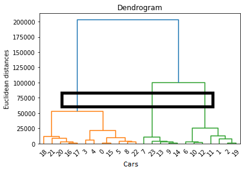
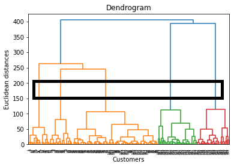
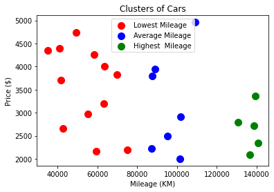
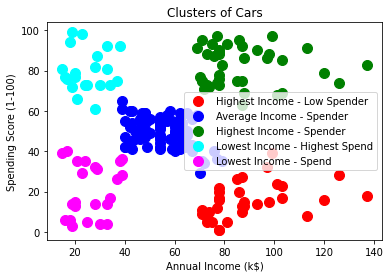

# dendrogram-hierarchical-clustering
Find optimal number of clusters using dendrogram.

### Dendrogram:
A diagram that represents the relationships of similarity among a group of entities, which facilitate clustering through the visualization of the distance between the entities/values/objects.
 
 * Split dendrogram into multiple clusters through setting the threshold at a custom/specific points based eculadine distance. Each intersection with a vertical line  represents a cluster (Highlighted in black square in below images)
 * The optimal number of clusters can be by looking for the highest vertical distance that doesn't cross a hypothetical horizontal line (the line that is placed in the same level horizontally)
 
 

Sample output after selecting number of clusters based on Dendrogram diagram.

